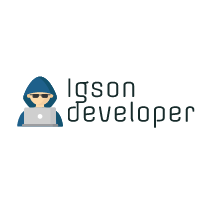

<h1 align="center">
    
</h1>

# Portifólio

## Descrição

Portifĺio meticulosamente elaborado para oferecer uma visão holística e envolvente das minhas habilidades e realizações no desenvolvimento de software. Com um design responsivo e intuitivo, o portfólio é segmentado em seções detalhadas, incluindo uma apresentação pessoal, habilidades técnicas, projetos destacados, histórico educacional e experiência profissional. Destaco meus projetos de maneira visualmente atraente, fornecendo informações detalhadas sobre as tecnologias empregadas, desafios superados e resultados alcançados. Incorporo links para o código-fonte e demonstrações de projetos para validar minha experiência. Além disso, integro redes sociais, como LinkedIn, e disponibilizo a opção de download do meu currículo para estabelecer uma presença online que reflete minha paixão pela programação e meu compromisso com a excelência técnica.

## Técnologias

## Licença

